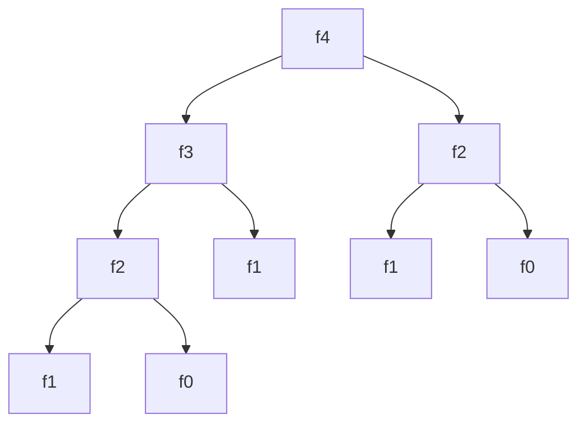

### 什么是递归

**递归**要和**迭代**比较着来看：

* **迭代**是重复反馈过程的活动，其目的通常是为了逼近所需目标活结构。每一次对过程的重复称为一次”迭代“，而每一次迭代得到的结果会做完下一次迭代的初始值，因此迭代是从前往后计算的。
* **递归**则是一步一步往前递推，知道递归基础，寻找一条路径，然后再由前向后计算。


#### 递归三要素

**案例**：求n的阶乘

**第一要素：明确你这个函数想要干什么**

对于递归，首先也是最重要的一个事情，**这个函数的功能是什么**，要完成什么事，而这个，完全由你来定义。

例如， 我定义了一个函数，这个函数的功能就是**算n的阶乘**

```c
int func(int n) {
}
```


**第二要素：寻找递归结束条件**

所谓递归，就是会在函数内部代码中，调用这个函数本身，所以，我们必须要找出**递归的结束条件**，不然的话，会一直调用自己，进入无底洞。也就是说，我们需要找出**当参数为啥时，递归结束，之后直接把结果返回**，请注意，这个时候我们必须能根据这个参数的值，能够**直接**知道函数的结果是什么。

例如，上面那个例子，当 n = 2 时，那你应该能够直接知道 f(n) 是啥吧？此时，f(2) = 2；当 n = 1 时，f(1) =1。

完善我们函数内部的代码，把第二要素加进代码里面，如下

```c
// 算 n 的阶乘(假设n不为0)
int func(int n) {
    if (n <= 2) {
        return n;
    }
}
```


**第三要素：找出函数的等价关系式**

第三要素就是，我们要**不断缩小参数的范围**，缩小之后，我们可以通过一些辅助的变量或者操作，使原函数的结果不变。

例如，f(n) 这个范围比较大，我们可以让 f(n) = n * f(n-1)。这样，范围就由 n 变成了 n-1 了，范围变小了，并且为了原函数f(n) 不变，我们需要让 f(n-1) 乘以 n。

说白了，就是要找到原函数的一个等价关系式，f(n) 的等价关系式为 n * f(n-1)，即

f(n) = n * f(n-1)

找出了这个等价，继续完善我们的代码，我们把这个等价式写进函数里。如下：

```c
// 算 n 的阶乘(假设n不为0)
int func(int n) {
    if (n <= 2) {
        return n;
    }
  // 把 f(n) 的等价操作写进去
  return f(n-1) * n;
}
```


### 递归过程


结合上面的这个案例，递归调用状态图如下：



### 递归工作栈

一个递归函数，在函数的执行过程中，需要多次进行自我调用。那么，递归函数是如何进行调用执行的呢？

首先，我们来了解一下任何的两个函数之间调用是如何进行的。

在高级语言的程序中，调用函数和被调用的函数之间的链接与信息交换都是通过栈来进行的。

通常，当一个函数的运行期间调用另一个函数时，在运行被调用函数之前，系统需要先完成3件事情：

1. 将所有的实参，返回地址等信息调用传递被调用函数保存
2. 为被调用函数的局部变量分配存储空间
3. 将控制转移到被调用函数

而从被调用的函数返回调用函数之前，系统同样需要完成3件事：

1. 保存被调用函数的计算结果
2. 释放被调用函数的数据区
3. 依照被调用函数保存的返回地址将控制转移到调用函数

当多个函数构成嵌套调用时，按照“先调用后返回”的原则，函数之间的信息传递和控制转移则通过“栈”来实现。即系统将整个程序运行时的所需要的数据空间都安排在一个栈中，当调用一个函数时，就在栈顶分配一个存储区；当函数退出时，就释放它的存储区。

递归函数的运行过程类似多个函数嵌套调用，只是调用函数和被调用函数是同一个函数。为了保证递归函数正确执行，系统需要设立一个“递归工作栈”作为整个递归函数运行期间使用的数据存储。

每一次递归所需信息构成一个工作记录，其中包括所有的实参，所有的局部变量以及上层的返回地址。每进入一层递归，就产生一个新的工作记录压入栈顶；每退出一个递归，就从栈顶弹出一个工作记录，则当前执行层的工作记录必须是递归工作栈栈顶的工作记录，称为“活动记录”

> [代码仓库地址](https://github.com/dev-jw/linearList)